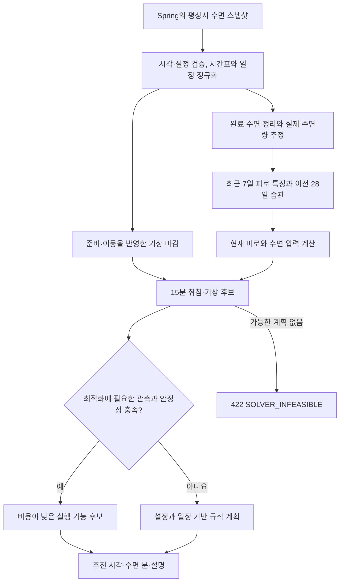

# AI-02 계산 흐름

```mermaid
flowchart TD
    A["Spring의 평상시 수면 스냅샷"] --> B["시각·설정 검증, 시간표와 일정 정규화"]
    B --> C["준비·이동을 반영한 기상 마감"]
    B --> D["완료 수면 정리와 실제 수면량 추정"]
    D --> E["최근 7일 피로 특징과 이전 28일 습관"]
    E --> F["현재 피로와 수면 압력 계산"]
    C --> G["15분 취침·기상 후보"]
    F --> G
    G --> H{"최적화에 필요한 관측과 안정성 충족?"}
    H -->|"예"| I["비용이 낮은 실행 가능 후보"]
    H -->|"아니요"| J["설정과 일정 기반 규칙 계획"]
    I --> K["추천 시각·수면 분·설명"]
    J --> K
    G -->|"가능한 계획 없음"| L["422 SOLVER_INFEASIBLE"]
```

[설계와 기반 자료](README.md) · [백엔드 연동](../BACKEND_INTEGRATION.md)
