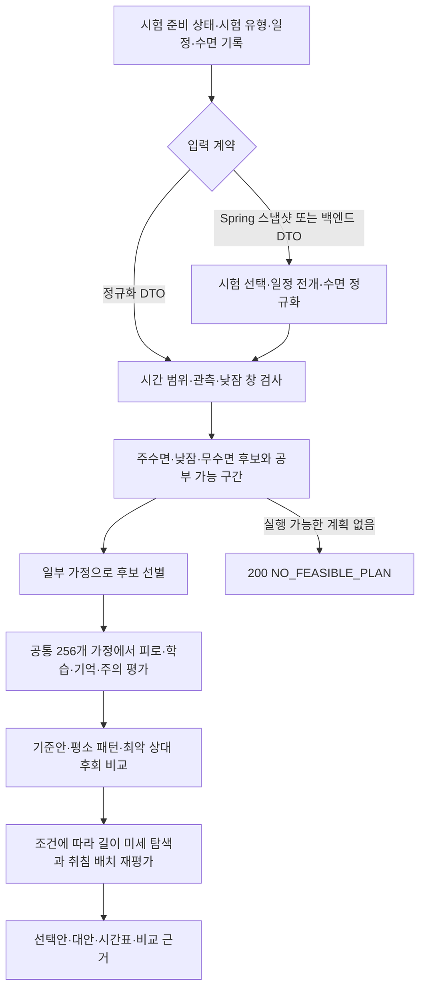

# AI-03 계산 흐름

```mermaid
flowchart TD
    A["시험 준비 상태·시험 유형·일정·수면 기록"] --> B{"입력 계약"}
    B -->|"Spring 스냅샷 또는 백엔드 DTO"| C["시험 선택·일정 전개·수면 정규화"]
    B -->|"정규화 DTO"| D["시간 범위·관측·낮잠 창 검사"]
    C --> D
    D --> E["주수면·낮잠·무수면 후보와 공부 가능 구간"]
    E --> F["일부 가정으로 후보 선별"]
    F --> G["공통 256개 가정에서 피로·학습·기억·주의 평가"]
    G --> H["기준안·평소 패턴·최악 상대 후회 비교"]
    H --> I["조건에 따라 길이 미세 탐색과 취침 배치 재평가"]
    I --> J["선택안·대안·시간표·비교 근거"]
    E -->|"실행 가능한 계획 없음"| K["200 NO_FEASIBLE_PLAN"]
```

[설계와 기반 자료](README.md) · [후보별 시뮬레이션 상세 흐름](docs/FLOW.md) · [백엔드 연동](../BACKEND_INTEGRATION.md)
