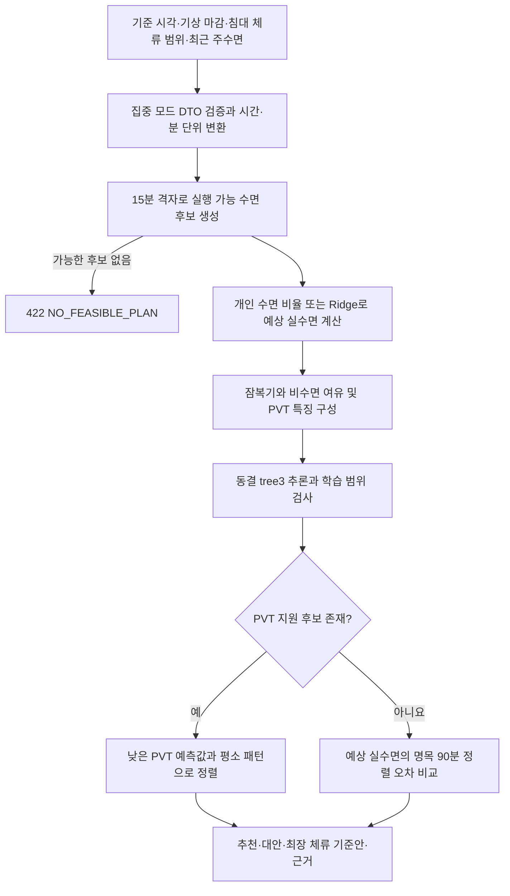

# AI-06 계산 흐름

```mermaid
flowchart TD
    A["기준 시각·기상 마감·침대 체류 범위·최근 주수면"] --> B["집중 모드 DTO 검증과 시간·분 단위 변환"]
    B --> C["15분 격자로 실행 가능 수면 후보 생성"]
    C -->|"가능한 후보 없음"| D["422 NO_FEASIBLE_PLAN"]
    C --> E["개인 수면 비율 또는 Ridge로 예상 실수면 계산"]
    E --> F["잠복기와 비수면 여유 및 PVT 특징 구성"]
    F --> G["동결 tree3 추론과 학습 범위 검사"]
    G --> H{"PVT 지원 후보 존재?"}
    H -->|"예"| I["낮은 PVT 예측값과 평소 패턴으로 정렬"]
    H -->|"아니요"| J["예상 실수면의 명목 90분 정렬 오차 비교"]
    I --> K["추천·대안·최장 체류 기준안·근거"]
    J --> K
```

[설계와 기반 자료](README.md) · [백엔드 연동](../BACKEND_INTEGRATION.md)
